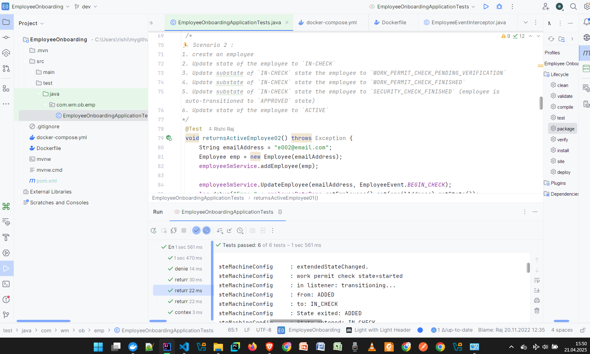

# Employee Onboarding State Machine
As a crucial HR Personnel function of HCM (Human Capital Management), this smart Human Resource Management System (HRMS) promises to assist leading firms with digitalization of adding more telent and velocity to their multinational teams. A must-have accelerator for modern large-scale enterprises as well as fast-growing startups.

## Salient Features
- Provision for highly concurrent execution of frequent functionalities.
- Allows for rapid onboarding of members, as part of a unified ERP solution.
- Reduces error rates (number of data errors per 1000 of persons onboarded) against manual undertaking of the functions.
- Flexible for minor variations and open for extention with more ERP functionalities.

## Targeted Users and Functional Areas
This is a great tool for the People and Culture (P&C Team), who undertake the following functions:
- Talent Acquisition (Headhunting)
- Hiring (the process of registering and welcoming the new member)
- Eymployee Onboarding (additional formalities post the registration stage, which include team orientation)

## Suggested Usage Scenarios in Business Functions
- to manage concurrent hiring (simultaneous) of people,
- concurrent employee onboarding

## Development Tools
- Java SE 21 (JDK 21)
- Spring Boot 3
- Spring StateMachine
- Lombok
- JUnit 5
- SpringBootTest
- Dockerfile with docker-compose

## Automated Test Result Summary

## To Start Docker Container
From within the project root directory, issue the following command (`$ ` is the Terminal prompt, not for any user to type in!):
<pre>$ docker-compose up</pre>

## The API Endpoints
- to add an employee
<pre>POST http://localhost:8080/api/v1/eob

Request Body (JSON) example:
{"emailAddress":"ecode1101@email.com",
"name":"my name",
"contract":"contract title",
"age":30,
"state":"ADDED"
}</pre>

- to update employee state
<pre>PUT http://localhost:8080/api/v1/eob?email=e004@email.com&event=BEGIN_CHECK</pre>

- to get employee details
<pre>GET http://localhost:8080/api/v1/eob?email=e004@email.com</pre>

## Notes
- A lighweight app, with very small footprint, has been designed and implemented. For green programming and sustainability.
- The app showcases transitions across various stages of employer-employee relationship.
- To minimise the cost in terms of development effort and time, the following technical requirements have not been implemented in ths MVP/PoC release:
  - ResponseEntity in Controller
  - Test cases for Controller
  - More test cases for Service, especially unhappy scenarios
  - Vast OpenAPI documentation

## Docker Image
This project is available to pull as a container image as well. Follow this link for exact details:
<pre>https://hub.docker.com/r/i50729/employeeonboarding</pre>

## Contact Points for Feedback, Queries, Collaboration
- LinkedIn Profile: https://www.linkedin.com/in/rishirajopenminds
- Contact Card: https://bio.link/rishiraj49de
- X: https://twitter.com/RishiRajDevOps
- Other Repositories: https://github.com/rishiraj88?tab=repositories
